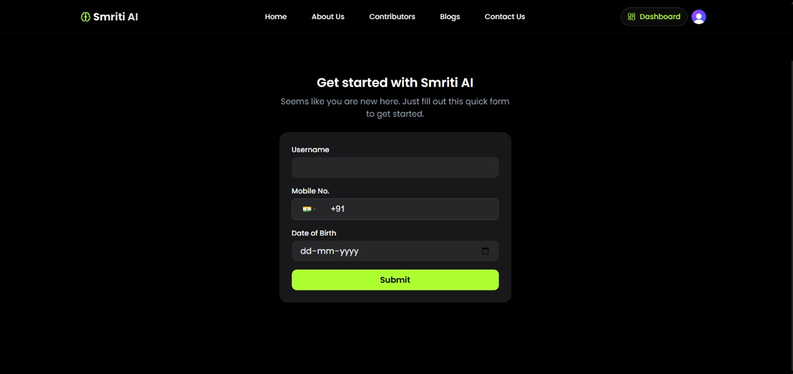
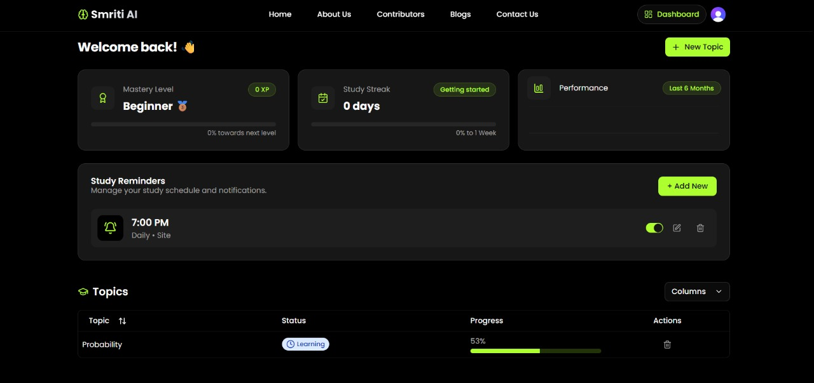
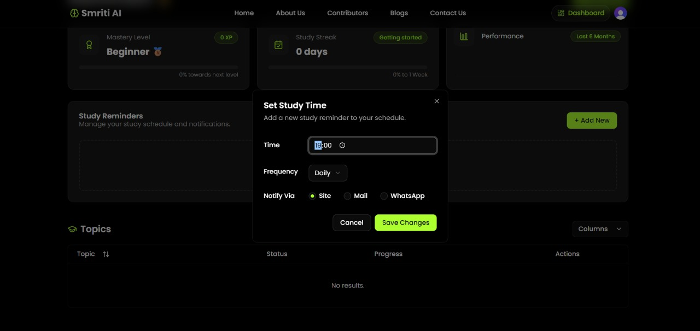
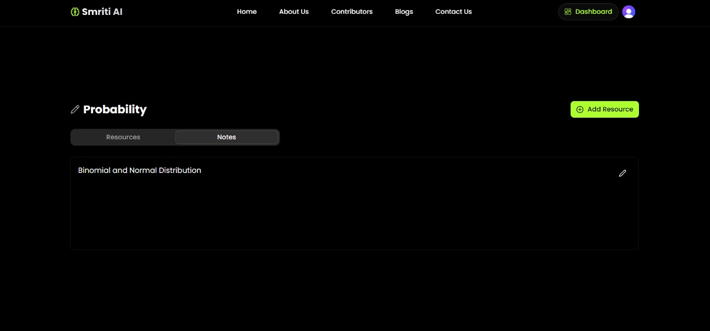

# Smriti AI – Your Smart Learning Companion

Smriti AI is an intelligent, all-in-one learning assistant that helps you **organize**, **understand**, and **retain** everything you study 🧠. Whether you're a student, a self-learner, or a professional, Smriti AI transforms passive content into active learning tools.

**📊 Project Insights**

<table align="center">
    <thead align="center">
        <tr>
            <td><b>🌟 Stars</b></td>
            <td><b>🍴 Forks</b></td>
            <td><b>🐛 Issues</b></td>
            <td><b>🔔 Open PRs</b></td>
            <td><b>🔕 Closed PRs</b></td>
            <td><b>🛠️ Languages</b></td>
            <td><b>👥 Contributors</b></td>
        </tr>
     </thead>
    <tbody>
         <tr>
            <td></td>
            <td></td>
            <td></td>
            <td></td>
            <td></td>
            <td></td>
            <td></td>
        </tr>
    </tbody>
</table>


<div align="center">
  
</div>


## 🛠️ Tech Stack

- 🧩 **Frontend**: Next.js, TypeScript, Tailwind CSS
- 🧠 **AI Layer**: Gemini APIS,LLMs
- 🔐 **Auth**: Clerk
- ☁️ **Backend**: Next.js,Prisma,Postgres
- 🤖 **Bot Layer**: WhatsApp + Twilio Integration
- 🧪 **Chrome Extension**: Capture videos directly from YouTube //upcoming

## 📸 Screenshots

Here’s a quick look at **Smriti AI in action** 👇

<p align="center"><b>🏠 Homepage</b></p>
<p align="center">
  
</p>

<p align="center"><b>🚀 Getting Started</b></p>
<p align="center">
  
</p>

<p align="center"><b>📊 Dashboard</b></p>
<p align="center">
  
</p>

<p align="center"><b>⏰ Study Reminder</b></p>
<p align="center">
  
</p>

<p align="center"><b>📝 Topic-wise Notes</b></p>
<p align="center">
  
</p>


## 🚀 Getting Started (Developer Mode)

Follow these steps to set up Smriti AI locally:

### 1. Set Up Supabase (Database)

1. Go to [https://supabase.com](https://supabase.com)
2. Create a new project
3. Copy the connection string and add it to your `.env.local` file:

```ini
DATABASE_URL=your_supabase_connection_string
```

### 2. Run Database Migrations

```bash
npx prisma generate
npx prisma db push
npx prisma studio # optional, for DB UI
```

### 3. Get API Keys & Configure Environment

#### Clerk (Authentication)

- Go to [https://dashboard.clerk.com](https://dashboard.clerk.com)
- Create a new application
- Add the following to `.env.local`:

```ini
CLERK_PUBLISHABLE_KEY=your_key
CLERK_SECRET_KEY=your_key
```

#### Google Gemini (AI)

- Go to [https://aistudio.google.com/app/apikey](https://aistudio.google.com/app/apikey)
- Add to `.env.local`:

```ini
GEMINI_API_KEY=your_key
```

#### YouTube API (Optional)

- Go to [https://console.cloud.google.com](https://console.cloud.google.com)
- Enable YouTube Data API v3
- Add to `.env.local`:

```ini
YOUTUBE_API_KEY=your_key
```

#### Cloudinary (Optional, for media uploads)

- Go to [https://cloudinary.com](https://cloudinary.com)
- Add to `.env.local`:

```ini
CLOUDINARY_CLOUD_NAME=your_name
CLOUDINARY_API_KEY=your_key
CLOUDINARY_API_SECRET=your_secret
```

#### Twilio (WhatsApp Reminders)

- Go to [https://www.twilio.com/console](https://www.twilio.com/console)
- Create a new project and get your credentials
- Add the following to `.env.local`:

```ini
TWILIO_ACCOUNT_SID=your_account_sid
TWILIO_AUTH_TOKEN=your_auth_token
TWILIO_PHONE_NUMBER=whatsapp:+14155238886 # Example format for WhatsApp
```

#### RapidAPI (YouTube Video Summarization)

- Go to [YouTube Video Summarizer GPT AI on RapidAPI](https://rapidapi.com/rahilkhan224/api/youtube-video-summarizer-gpt-ai/playground)
- Subscribe and get your API credentials
- Add the following to `.env.local`:

```ini
RAPIDAPI_HOST=your_rapidapi_host
RAPIDAPI_KEY=your_rapidapi_key
RAPIDAPI_URL=your_rapidapi_url
```

### 4. Install Dependencies & Run the App

```bash
git clone https://github.com/vatsal-bhakodia/smriti-ai
cd smriti-ai
npm install
npm run dev
```

The app should now be running at [http://localhost:3000](http://localhost:3000) 🚀


<h2 align="center">🎯 Open Source Programmes ⭐</h2>
<p align="center">
  <b>This project is now OFFICIALLY accepted for:</b>
</p>


🌟 **Exciting News...**

🚀 This project is now an official part of GirlScript Summer of Code – GSSoC'25! 💃🎉💻 We're thrilled to welcome contributors from all over India and beyond to collaborate, build, and grow SmartLog. Let’s make learning and career development smarter – together! 🌟👨‍💻👩‍💻

👩‍💻 GSSoC is one of India’s **largest 3-month-long open-source programs** that encourages developers of all levels to contribute to real-world projects 🌍 while learning, collaborating, and growing together. 🌱

🌈 With **mentorship, community support**, and **collaborative coding**, it's the perfect platform for developers to:

✨ Improve their skills
🤝 Contribute to impactful projects
🏆 Get recognized for their work
📜 Receive certificates and swag!

🎉 **I can’t wait to welcome new contributors** from GSSoC 2025 to this SmartLog project family! Let's build, learn, and grow together — one commit at a time. 🔥👨‍💻👩‍💻


## ✨ Why Smriti AI?

In today's world of scattered PDFs, YouTube videos, and online tutorials — **Smriti AI brings it all together.**

🚀 **Capture** resources from YouTube, PDFs, and links  
🧠 **Convert** them into summaries, mind maps, and personalized quizzes  
⏰ **Revise** smarter with spaced repetition and WhatsApp reminders  
📈 **Track** progress and stay motivated with performance dashboards


## 🌟 Features

📁 **Centralized Learning Hub**  
Organize your learning by creating topic-wise folders. Store PDFs, videos, and links all in one place.

🪄 **Smart Content Processing**  
Smriti breaks down your content into:

- 📄 AI-generated summaries
- 🧭 Mind maps for visual learners
- ❓ Interactive quizzes to boost recall

⏳ **Spaced Revision with WhatsApp Reminders**  
Receive gentle reminders every 3 days to revise. Quizzes are delivered directly on WhatsApp for on-the-go revision.

📊 **Progress Tracking**  
See how much you’ve improved over time, identify weak areas, and never lose track of your learning.

💬 **Multimodal Interface**  
Use it on web, and soon — on WhatsApp & mobile apps too!


## 👥 Who Is It For?

👨‍🎓 **Students** – Preparing for exams, juggling multiple subjects  
🧑‍💻 **Self-learners** – Taking online courses or watching tutorials  
👩‍💼 **Professionals** – Upskilling with limited time  
👨‍🏫 **Educators & Coaching Institutes** – To create structured, AI-enhanced revision modules


**🤝👤 Contribution Guidelines**

We love our contributors! If you'd like to help, please check out our [`CONTRIBUTE.md`](https://github.com/vatsal-bhakodia/smriti-ai/blob/main/CONTRIBUTING.md) file for guidelines.

> Thank you once again to all our contributors who has contributed to **SmartLog!** Your efforts are truly appreciated. 💖👏

<!-- Contributors badge (auto-updating) -->

[](https://github.com/vatsal-bhakodia/smriti-ai/graphs/contributors)

<!-- Contributors avatars (auto-updating) -->
<p align="left">
  <a href="https://github.com/vatsal-bhakodia/smriti-ai/graphs/contributors">
    
  </a>
</p>

See the full list of contributors and their contributions on the [`GitHub Contributors Graph`](https://github.com/vatsal-bhakodia/smriti-ai/graphs/contributors).

<p align="center">
<p style="font-family:var(--ff-philosopher);font-size:3rem;"><b> Show some  by starring this awesome repository! </p>
</p>

**💡 Suggestions & Feedback**

Feel free to open issues or discussions if you have any feedback, feature suggestions, or want to collaborate!


**📄 License**

This project is licensed under the MIT License - see the [`License`](https://github.com/vatsal-bhakodia/smriti-ai/blob/main/LICENSE) file for details.


**⭐ Stargazers**

<div align="center">
  <a href="https://github.com/vatsal-bhakodia/smriti-ai/stargazers">
    
  </a>
</div>


**🍴 Forkers**

<div align="center">
  <a href="https://github.com/vatsal-bhakodia/smriti-ai/network/members">
    
  </a>


<h2>Project Admin:</h2>
<table>
<tr>
<td align="center">
<a href="https://github.com/vatsal-bhakodia"></a><br><sub><b>Vatsal Bhakodia</b><br><a href="https://www.linkedin.com/in/vatsal-bhakodia/"></a></sub>
</td>
</tr>
</table>


**👨‍🏫 Mentors – smriti-ai (GSSoC'25)**

| Name          | GitHub Profile                                | LinkedIn Profile                                                      |
| ------------- | --------------------------------------------- | --------------------------------------------------------------------- |
| Sanjana Gurav | [213sanjana](https://github.com/213sanjana)   | [sanjana-gurav](https://www.linkedin.com/in/sanjana-gurav-59357028a/) |
| Bhavik Dodda  | [BhavikDodda](https://github.com/BhavikDodda) | [bhavik-dodda](https://www.linkedin.com/in/bhavik-dodda/)             |


<h1 align="center"> Give us a Star and let's make magic! </h1>

<p align="center">
     
</p>

**👨‍💻 Developed By**
**❤️Vatsal Bhakodia and Contributors❤️** [Watch Demo](https://www.smriti.live/) • [Request Feature](https://github.com/vatsal-bhakodia/smriti-ai/issues)

<div align="center">
    <a href="#top">
        
    </a>
</div>


